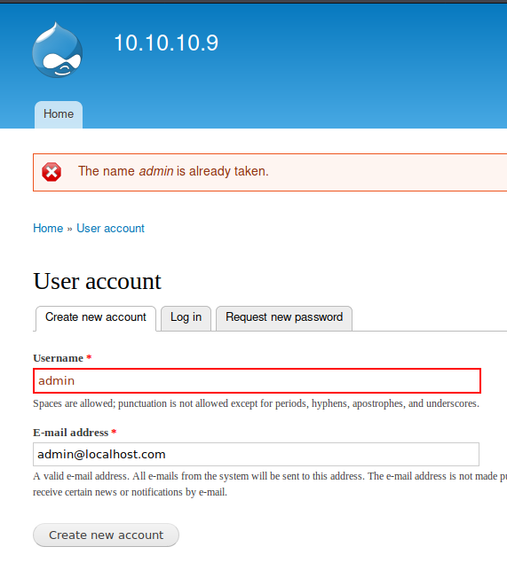
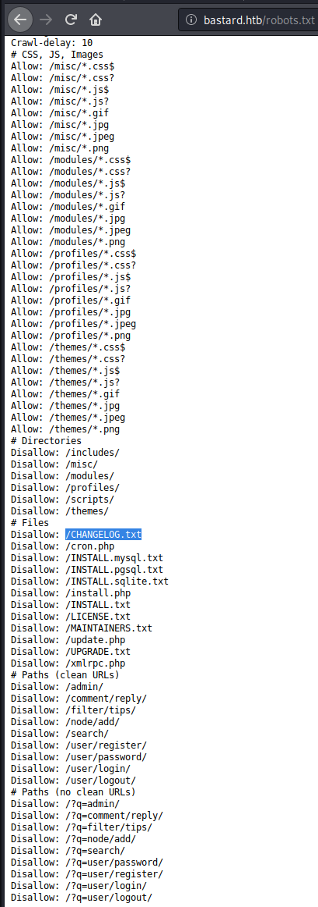
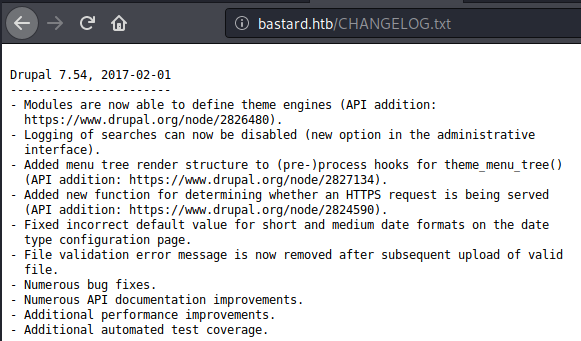
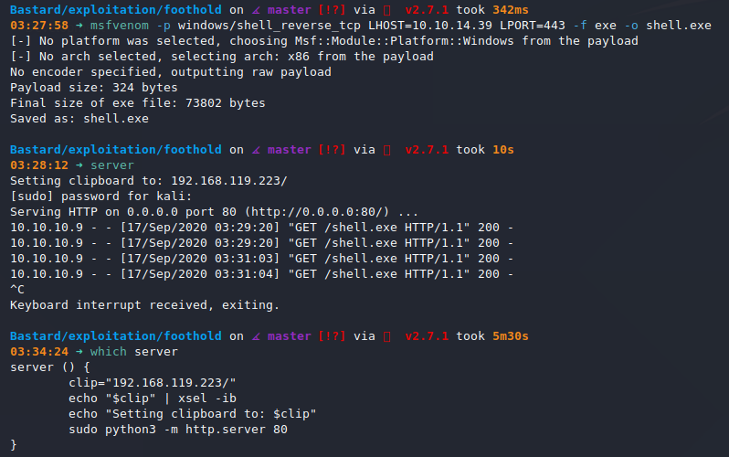
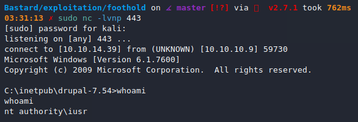

# Bastard (`10.10.10.9`)

## Summary

## `/etc/hosts`

I begin by adding an entry in `/etc/hosts` to resolve `bastard.htb` to `10.10.10.9`. I use this later in my report.

## Enumeration

I start a portscan of all ports (`-p-`), running OS, service version, and vulnerability scripts (`-A`), skipping host discovery (`-Pn`), with verbose logging (`-v`) and output to a file (`-oN`).

```bash
$ nmap -A -v -p- -Pn -oN allports bastard.htb
# Nmap 7.80 scan initiated Thu Sep 17 02:54:10 2020 as: nmap -A -sVC -v -p- -Pn -oA allports bastard.htb
Nmap scan report for bastard.htb (10.10.10.9)
Host is up (0.047s latency).
Not shown: 65532 filtered ports
PORT      STATE SERVICE VERSION
80/tcp    open  http    Microsoft IIS httpd 7.5
|_http-favicon: Unknown favicon MD5: CF2445DCB53A031C02F9B57E2199BC03
|_http-generator: Drupal 7 (http://drupal.org)
| http-methods: 
|   Supported Methods: OPTIONS TRACE GET HEAD POST
|_  Potentially risky methods: TRACE
| http-robots.txt: 36 disallowed entries (15 shown)
| /includes/ /misc/ /modules/ /profiles/ /scripts/ 
| /themes/ /CHANGELOG.txt /cron.php /INSTALL.mysql.txt 
| /INSTALL.pgsql.txt /INSTALL.sqlite.txt /install.php /INSTALL.txt 
|_/LICENSE.txt /MAINTAINERS.txt
|_http-server-header: Microsoft-IIS/7.5
|_http-title: Welcome to 10.10.10.9 | 10.10.10.9
135/tcp   open  msrpc   Microsoft Windows RPC
49154/tcp open  msrpc   Microsoft Windows RPC
Warning: OSScan results may be unreliable because we could not find at least 1 open and 1 closed port
Device type: general purpose|phone|specialized
Running (JUST GUESSING): Microsoft Windows 8|Phone|2008|7|8.1|Vista|2012 (92%)
OS CPE: cpe:/o:microsoft:windows_8 cpe:/o:microsoft:windows cpe:/o:microsoft:windows_server_2008:r2 cpe:/o:microsoft:windows_7 cpe:/o:microsoft:windows_8.1 cpe:/o:microsoft:windows_vista::- cpe:/o:microsoft:windows_vista::sp1 cpe:/o:microsoft:windows_server_2012
Aggressive OS guesses: Microsoft Windows 8.1 Update 1 (92%), Microsoft Windows Phone 7.5 or 8.0 (92%), Microsoft Windows 7 or Windows Server 2008 R2 (91%), Microsoft Windows Server 2008 R2 (91%), Microsoft Windows Server 2008 R2 or Windows 8.1 (91%), Microsoft Windows Server 2008 R2 SP1 or Windows 8 (91%), Microsoft Windows 7 (91%), Microsoft Windows 7 Professional or Windows 8 (91%), Microsoft Windows 7 SP1 or Windows Server 2008 R2 (91%), Microsoft Windows 7 SP1 or Windows Server 2008 SP2 or 2008 R2 SP1 (91%)
No exact OS matches for host (test conditions non-ideal).
Uptime guess: 0.003 days (since Thu Sep 17 02:52:53 2020)
Network Distance: 2 hops
TCP Sequence Prediction: Difficulty=260 (Good luck!)
IP ID Sequence Generation: Incremental
Service Info: OS: Windows; CPE: cpe:/o:microsoft:windows

TRACEROUTE (using port 135/tcp)
HOP RTT      ADDRESS
1   44.64 ms 10.10.14.1
2   44.65 ms bastard.htb (10.10.10.9)

Read data files from: /usr/bin/../share/nmap
OS and Service detection performed. Please report any incorrect results at https://nmap.org/submit/ .
# Nmap done at Thu Sep 17 02:57:48 2020 -- 1 IP address (1 host up) scanned in 218.31 seconds
```

The current attack surface is:

- Drupal 7.54







Brute forcing was a bad idea.

## Reverse Shell


We get code execution with this exploit.


It drops us into an interactive shell.


I generate a reverse shell payload with `msfvenom` and host it on a python server.



I start a listener, download `shell.exe` onto my target and run it.




## Privilege Escalation


I upload `nc.exe` and `JuicyPotato` to the target and use that to privesc. The `SeImpersonatePrivilege` is the give-away.


