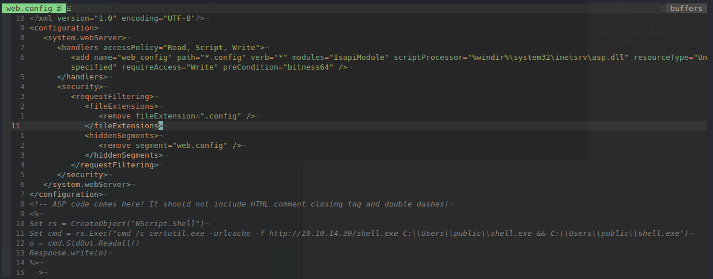
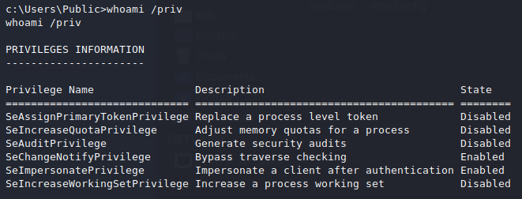
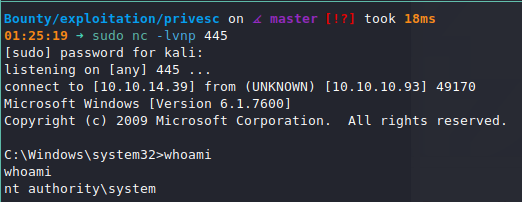
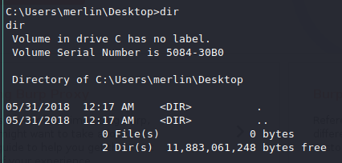

# Bounty (`10.10.10.93`)

## Summary

## `/etc/hosts`

I begin by adding an entry in `/etc/hosts` to resolve `bounty.htb` to `10.10.10.93`. I use this later in my report.

## Enumeration

I start a portscan of all ports (`-p-`), running OS, service version, and vulnerability scripts (`-A`), skipping host discovery (`-Pn`), with verbose logging (`-v`) and output to a file (`-oN`).

```bash
$ nmap -A -v -p- -Pn -oN allports bounty.htb
# Nmap 7.80 scan initiated Mon Sep 14 21:32:08 2020 as: nmap -A -sVC -v -p- -Pn -oA allports bounty.htb
Nmap scan report for bounty.htb (10.10.10.93)
Host is up (0.045s latency).
Not shown: 65534 filtered ports
PORT   STATE SERVICE VERSION
80/tcp open  http    Microsoft IIS httpd 7.5
| http-methods:
|   Supported Methods: OPTIONS TRACE GET HEAD POST
|_  Potentially risky methods: TRACE
|_http-server-header: Microsoft-IIS/7.5
|_http-title: Bounty
Warning: OSScan results may be unreliable because we could not find at least 1 open and 1 closed port
Device type: specialized|general purpose|phone
Running (JUST GUESSING): Microsoft Windows 7|8|Phone|2008|8.1|Vista (90%)
OS CPE: cpe:/o:microsoft:windows_7 cpe:/o:microsoft:windows_8 cpe:/o:microsoft:windows cpe:/o:microsoft:windows_server_2008:r2 cpe:/o:microsoft:windows_8.1 cpe:/o:microsoft:windows_vista::- cpe:/o:microsoft:windows_vista::sp1
Aggressive OS guesses: Microsoft Windows Embedded Standard 7 (90%), Microsoft Windows 8.1 Update 1 (90%), Microsoft Windows Phone 7.5 or 8.0 (90%), Microsoft Windows 7 or Windows Server 2008 R2 (90%), Microsoft Windows Server 2008 R2 (90%), Microsoft Windows Server 2008 R2 or Windows 8.1 (90%), Microsoft Windows Server 2008 R2 SP1 (90%), Microsoft Windows Server 2008 R2 SP1 or Windows 8 (90%), Microsoft Windows 7 (90%), Microsoft Windows 7 Professional or Windows 8 (90%)
No exact OS matches for host (test conditions non-ideal).
Uptime guess: 0.002 days (since Mon Sep 14 21:31:31 2020)
Network Distance: 2 hops
TCP Sequence Prediction: Difficulty=258 (Good luck!)
IP ID Sequence Generation: Randomized
Service Info: OS: Windows; CPE: cpe:/o:microsoft:windows

TRACEROUTE (using port 80/tcp)
HOP RTT      ADDRESS
1   43.73 ms 10.10.14.1
2   43.71 ms bounty.htb (10.10.10.93)

Read data files from: /usr/bin/../share/nmap
OS and Service detection performed. Please report any incorrect results at https://nmap.org/submit/ .
# Nmap done at Mon Sep 14 21:34:54 2020 -- 1 IP address (1 host up) scanned in 165.74 seconds
```

Found a file upload page with `gobuster`.


https://soroush.secproject.com/blog/2014/07/upload-a-web-config-file-for-fun-profit/


And we've got RCE.

I generate a shell with `msfvenom`.


I create a malicious `web.config` that downloads and executes my shell from a web server (`$ sudo python3 -m http.server 80`)



I upload and execute my `web.config` after starting a `nc` shell.


## Privilege Escalation



`SeImpersonatePrivilege` indicates this might be vulnerable to `JuicyPotato`.

I upload `nc.exe` and `JuicyPotato.exe`, start a `nc` listener and get a root shell.




## Proofs

The `user.txt` file is hidden. Unhide it and it's printable.



