# Brainfuck (`10.10.10.17`)

## Summary

I discover a Wordpress 4.7 installation. I use `wpscan` to find a vulnerable plugin: `WP Support Plus Responsive Ticket System`. I use an exploit to gain `admin` access to the Wordpress website. I find SMTP credentials that I use to access an IMAP service to download `orestis`'s mail. In the mailbox, I find credentials to `sup3rs3cr3t.brainfuck.htb`. I crack the Vignere cipher encyryption on the SSH key recovery instructions, and crack the password to the SSH key that has been recovered. I escalate to `root` using an `lxc/lxd` exploit.

## `/etc/hosts`

I begin by adding an entry in `/etc/hosts` to resolve `brainfuck.htb` to `10.10.10.17`. I use this later in my report.

## Enumeration

I start a portscan of all ports (`-p-`), running OS, service version, and vulnerability scripts (`-A`), skipping host discovery (`-Pn`), with verbose logging (`-v`) and output to a file (`-oN`).

```bash
$ nmap -A -v -p- -Pn -oN allports brainfuck.htb
# Nmap 7.91 scan initiated Thu Dec 31 23:10:40 2020 as: nmap -A -v -p- -Pn -oN allports brainfuck.htb
Nmap scan report for brainfuck.htb (10.10.10.17)
Host is up (0.040s latency).
Not shown: 65530 filtered ports
PORT    STATE SERVICE  VERSION
22/tcp  open  ssh      OpenSSH 7.2p2 Ubuntu 4ubuntu2.1 (Ubuntu Linux; protocol 2.0)
| ssh-hostkey: 
|   2048 94:d0:b3:34:e9:a5:37:c5:ac:b9:80:df:2a:54:a5:f0 (RSA)
|   256 6b:d5:dc:15:3a:66:7a:f4:19:91:5d:73:85:b2:4c:b2 (ECDSA)
|_  256 23:f5:a3:33:33:9d:76:d5:f2:ea:69:71:e3:4e:8e:02 (ED25519)
25/tcp  open  smtp     Postfix smtpd
|_smtp-commands: brainfuck, PIPELINING, SIZE 10240000, VRFY, ETRN, STARTTLS, ENHANCEDSTATUSCODES, 8BITMIME, DSN, 
110/tcp open  pop3     Dovecot pop3d
|_pop3-capabilities: SASL(PLAIN) AUTH-RESP-CODE USER PIPELINING RESP-CODES UIDL CAPA TOP
143/tcp open  imap     Dovecot imapd
|_imap-capabilities: Pre-login LOGIN-REFERRALS post-login more IDLE listed SASL-IR ID capabilities AUTH=PLAINA0001 LITERAL+ OK IMAP4rev1 have ENABLE
443/tcp open  ssl/http nginx 1.10.0 (Ubuntu)
|_http-generator: WordPress 4.7.3
| http-methods: 
|_  Supported Methods: GET HEAD POST
|_http-server-header: nginx/1.10.0 (Ubuntu)
|_http-title: Brainfuck Ltd. &#8211; Just another WordPress site
| ssl-cert: Subject: commonName=brainfuck.htb/organizationName=Brainfuck Ltd./stateOrProvinceName=Attica/countryName=GR
| Subject Alternative Name: DNS:www.brainfuck.htb, DNS:sup3rs3cr3t.brainfuck.htb
| Issuer: commonName=brainfuck.htb/organizationName=Brainfuck Ltd./stateOrProvinceName=Attica/countryName=GR
| Public Key type: rsa
| Public Key bits: 3072
| Signature Algorithm: sha256WithRSAEncryption
| Not valid before: 2017-04-13T11:19:29
| Not valid after:  2027-04-11T11:19:29
| MD5:   cbf1 6899 96aa f7a0 0565 0fc0 9491 7f20
|_SHA-1: f448 e798 a817 5580 879c 8fb8 ef0e 2d3d c656 cb66
|_ssl-date: TLS randomness does not represent time
| tls-alpn: 
|_  http/1.1
| tls-nextprotoneg: 
|_  http/1.1
Warning: OSScan results may be unreliable because we could not find at least 1 open and 1 closed port
Aggressive OS guesses: Linux 3.10 - 4.11 (91%), Linux 3.12 (91%), Linux 3.13 (91%), Linux 3.13 or 4.2 (91%), Linux 3.16 (91%), Linux 3.16 - 4.6 (91%), Linux 3.18 (91%), Linux 3.2 - 4.9 (91%), Linux 3.8 - 3.11 (91%), Linux 4.2 (91%)
No exact OS matches for host (test conditions non-ideal).
Uptime guess: 198.840 days (since Tue Jun 16 04:03:42 2020)
Network Distance: 2 hops
TCP Sequence Prediction: Difficulty=257 (Good luck!)
IP ID Sequence Generation: All zeros
Service Info: Host:  brainfuck; OS: Linux; CPE: cpe:/o:linux:linux_kernel

TRACEROUTE (using port 22/tcp)
HOP RTT      ADDRESS
1   40.05 ms 10.10.14.1
2   40.08 ms brainfuck.htb (10.10.10.17)

Read data files from: /usr/bin/../share/nmap
OS and Service detection performed. Please report any incorrect results at https://nmap.org/submit/ .
# Nmap done at Thu Dec 31 23:13:21 2020 -- 1 IP address (1 host up) scanned in 161.26 seconds
```

I notice `DNS:sup3rs3cr3t.brainfuck.htb` in the output, so I add that to my `/etc/hosts` file.

### Enumerating Port 443

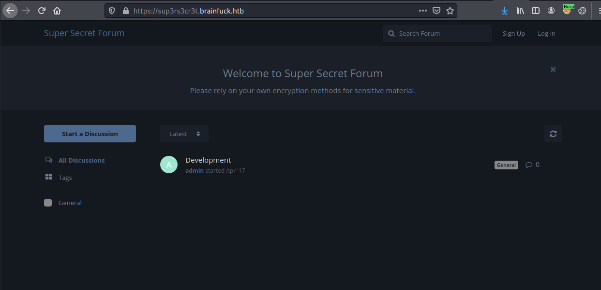

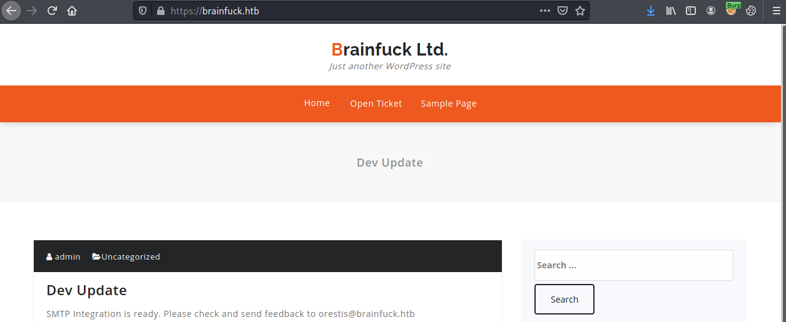

Two usernames appear: `admin` and `orestis`.

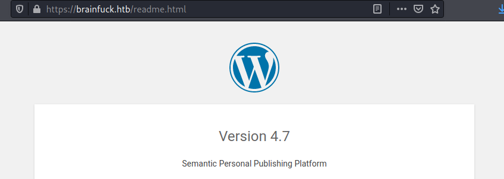

`Wordpress 4.7` is running. I run `wpscan` to enumerate the site: `$ wpscan --url https://brainfuck.htb --enumerate ap,at,cb,dbe,u --disable-tls-checks > wpscan.` It finds an out of date plugin: `WP Support Plus`.


I search for exploits, and find one for `v7.1.3`.


I modify the exploit as follows.


I open this file in Firefox and hit the Login button.


I refresh the WordPress site and I'm logged in as the `admin`.


I browse to the site administration tab.

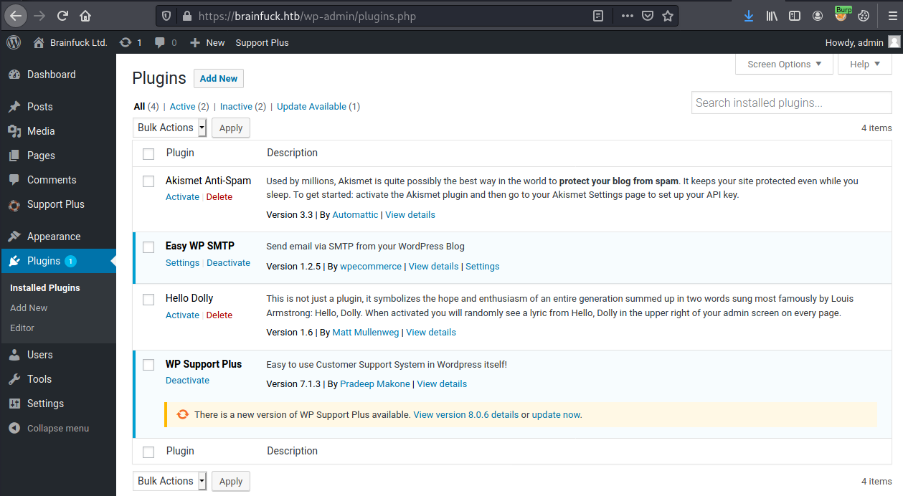

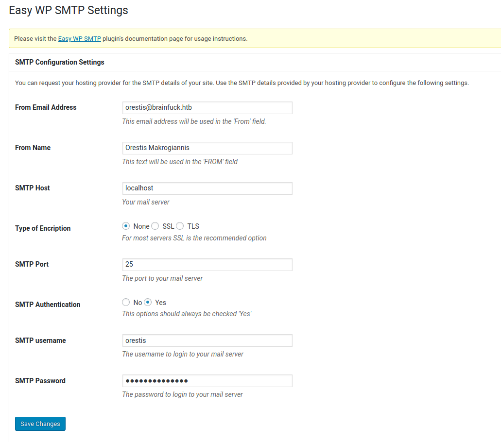

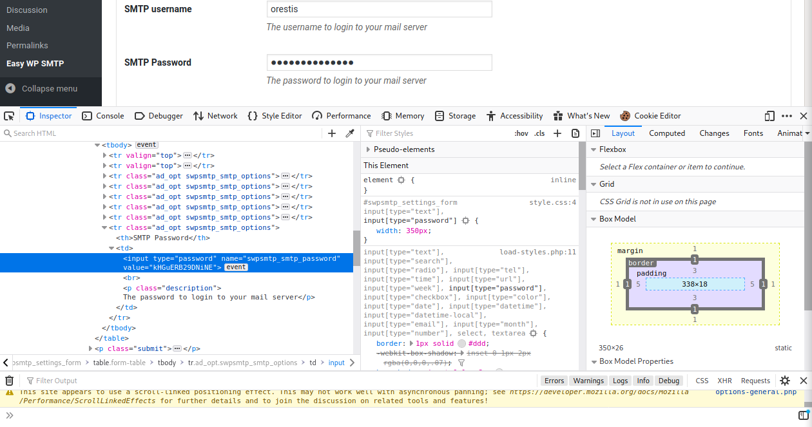

`orestis:kHGuERB29DNiNE` seem to be the SMTP credentials. 

I use [`imapbox`](https://github.com/polo2ro/imapbox/pulls) to dump the emails from the SMTP server. I clone and then modify the script to remove SSL support with: `$ sed -i "s/IMAP4_SSL/IMAP4/g" mailboxresource.py`. I create the config:

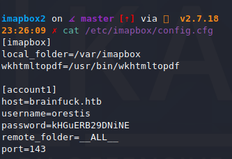

And I create the destination directory.

```bash
$ sudo mkdir /var/imapbox
```

And then run the script:


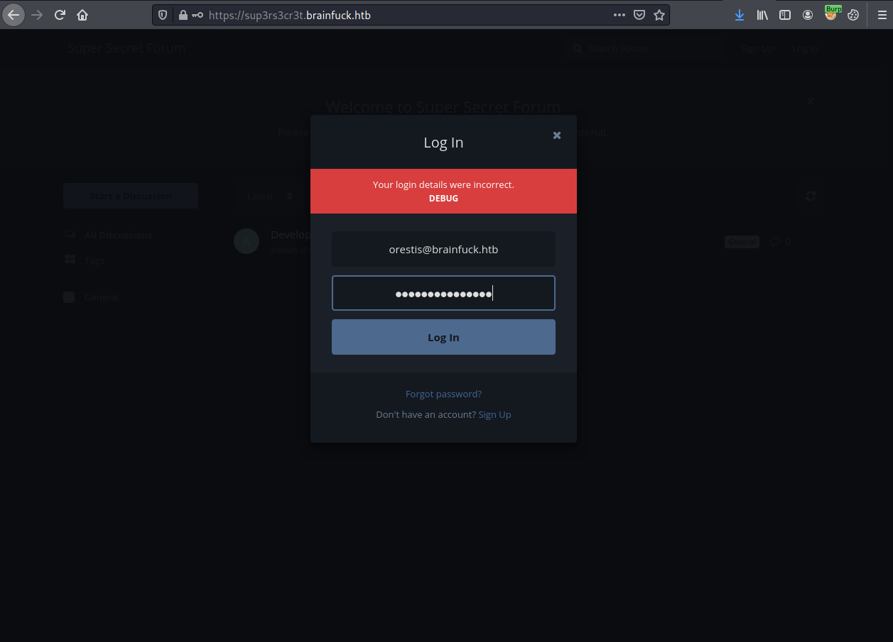

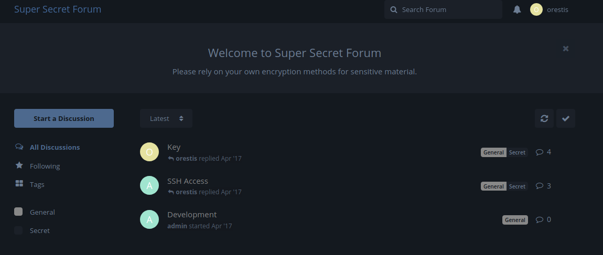

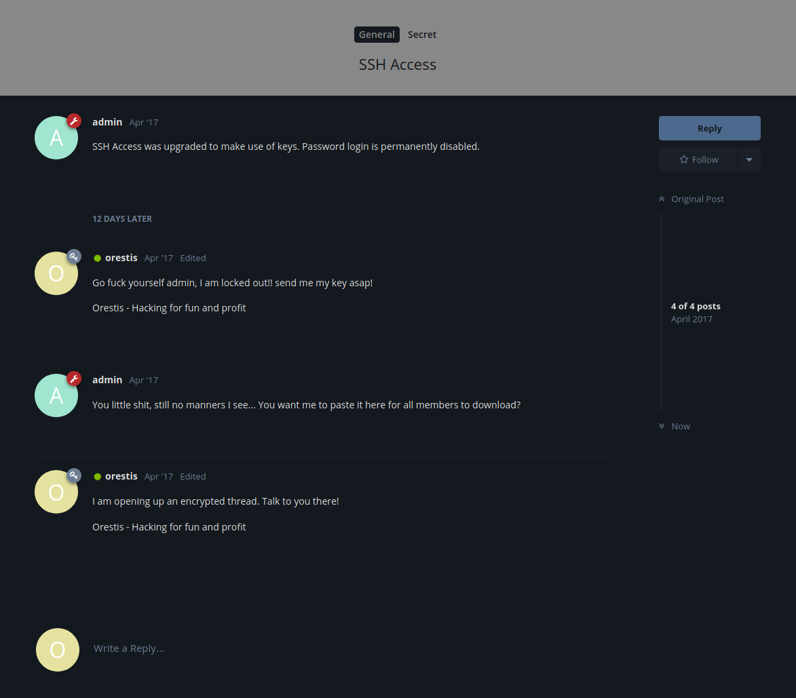

Orestis always signs his messages with the same line, but the ciphertext is different in all of the messages. This suggests a Vignere cipher is being used, and since we have both a plaintext and ciphertext, we can crack it using this attack: https://crypto.stackexchange.com/questions/12195/find-the-key-to-a-vigen%C3%A8re-cipher-given-known-ciphertext-and-plaintext.

Code stolen from: https://ranakhalil101.medium.com/hack-the-box-brainfuck-writeup-w-o-metasploit-5075c0c55e93

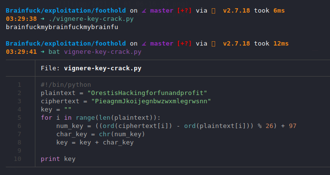

Seems like the key is `fuckmybrain`.


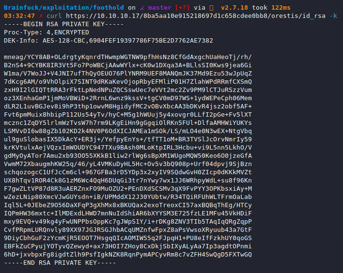


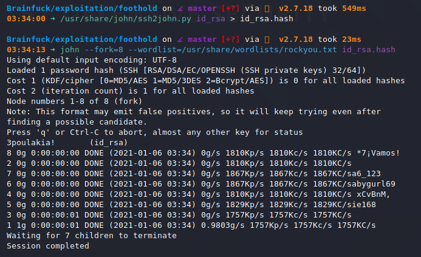

`john` cracks the password easily: `3poulakia!`


## Privilege Escalation to `root`

I use an `lxc/lxd` exploit I learned from reading [0xdf's HTB Tabby writeup.](https://0xdf.gitlab.io/2020/11/07/htb-tabby.html#better-lxc-root)


