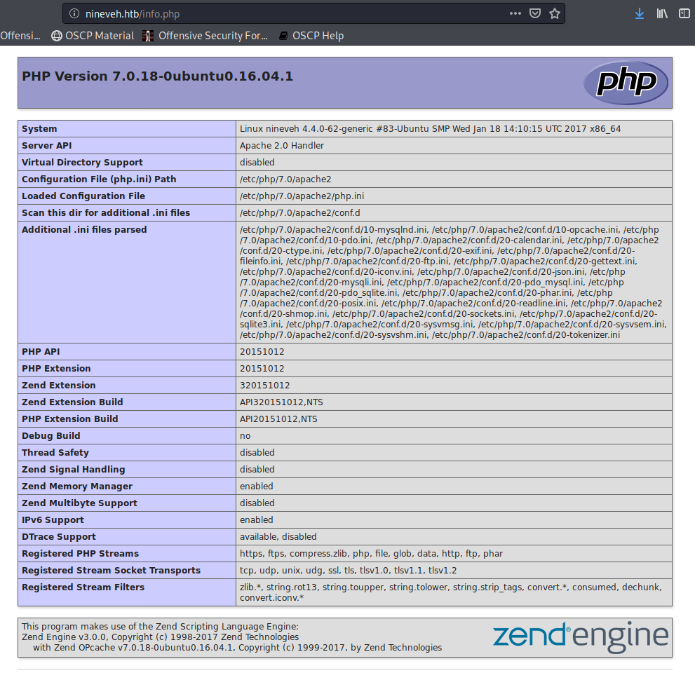
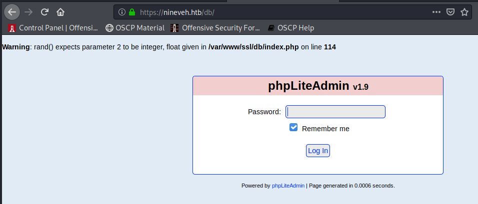
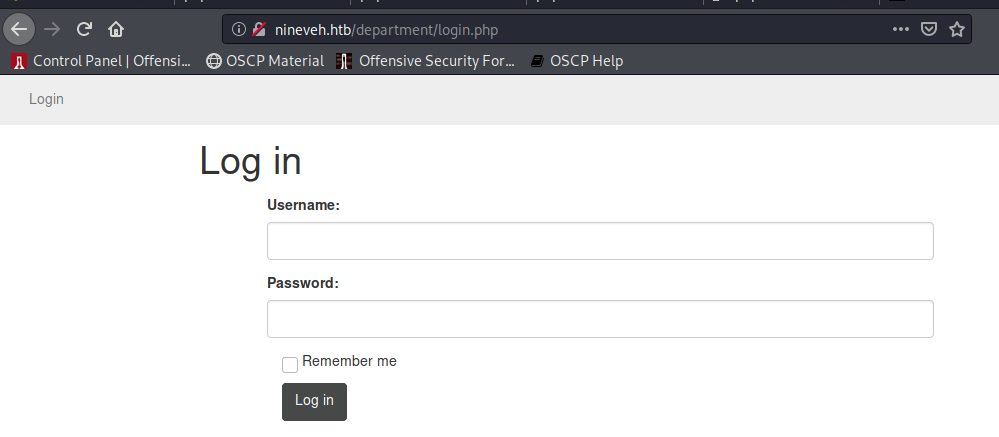
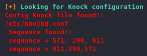
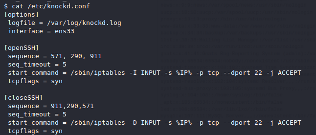

# Nineveh (`10.10.10.43`)

## Summary

## `/etc/hosts`

I begin by adding an entry in `/etc/hosts` to resolve `nineveh.htb` to `10.10.10.43`. I use this later in my report.

## Enumeration

I start a portscan of all ports (`-p-`), running OS, service version, and vulnerability scripts (`-A`), skipping host discovery (`-Pn`), with verbose logging (`-v`) and output to a file (`-oN`).

```bash
$ nmap -A -v -p- -Pn -oN allports nineveh.htb
# Nmap 7.80 scan initiated Thu Sep  3 22:51:27 2020 as: nmap -A -sVC -v -p- -Pn -oA allports nineveh.htb
Nmap scan report for nineveh.htb (10.10.10.43)
Host is up (0.045s latency).
Not shown: 65533 filtered ports
PORT    STATE SERVICE VERSION
80/tcp  open  http    Apache httpd 2.4.18 ((Ubuntu))
| http-methods: 
|_  Supported Methods: GET HEAD POST OPTIONS
|_http-server-header: Apache/2.4.18 (Ubuntu)
|_http-title: Site doesn't have a title (text/html).
443/tcp open  ssl/ssl Apache httpd (SSL-only mode)
| http-methods: 
|_  Supported Methods: GET HEAD POST OPTIONS
|_http-server-header: Apache/2.4.18 (Ubuntu)
|_http-title: Site doesn't have a title (text/html).
| ssl-cert: Subject: commonName=nineveh.htb/organizationName=HackTheBox Ltd/stateOrProvinceName=Athens/countryName=GR
| Issuer: commonName=nineveh.htb/organizationName=HackTheBox Ltd/stateOrProvinceName=Athens/countryName=GR
| Public Key type: rsa
| Public Key bits: 2048
| Signature Algorithm: sha256WithRSAEncryption
| Not valid before: 2017-07-01T15:03:30
| Not valid after:  2018-07-01T15:03:30
| MD5:   d182 94b8 0210 7992 bf01 e802 b26f 8639
|_SHA-1: 2275 b03e 27bd 1226 fdaa 8b0f 6de9 84f0 113b 42c0
|_ssl-date: TLS randomness does not represent time
| tls-alpn: 
|_  http/1.1
Warning: OSScan results may be unreliable because we could not find at least 1 open and 1 closed port
Aggressive OS guesses: Linux 3.10 - 4.11 (91%), Linux 3.13 (91%), Linux 3.13 or 4.2 (91%), Linux 3.16 (91%), Linux 3.16 - 4.6 (91%), Linux 3.2 - 4.9 (91%), Linux 4.2 (91%), Linux 4.4 (91%), Linux 4.8 (91%), Linux 4.9 (91%)
No exact OS matches for host (test conditions non-ideal).
Uptime guess: 198.840 days (since Tue Feb 18 01:44:24 2020)
Network Distance: 2 hops
TCP Sequence Prediction: Difficulty=262 (Good luck!)
IP ID Sequence Generation: All zeros

TRACEROUTE (using port 80/tcp)
HOP RTT      ADDRESS
1   43.27 ms 10.10.14.1
2   43.27 ms nineveh.htb (10.10.10.43)

Read data files from: /usr/bin/../share/nmap
OS and Service detection performed. Please report any incorrect results at https://nmap.org/submit/ .
# Nmap done at Thu Sep  3 22:53:49 2020 -- 1 IP address (1 host up) scanned in 141.79 seconds
```






https://www.exploit-db.com/exploits/24044





After playing around with the LFI (`http://10.10.10.43/department/manage.php?notes=files/ninevehNotes.txt`) on port 80 for a bit, I was able to spawn a shell by accessing the following URL: `http://10.10.10.43/department/manage.php?notes=files/ninevehNotes/../../../../../../var/tmp/shell.php`.


## Privilege Escalation

I move `linPEAS.sh` over and run it.





I run `pspy` and see `chkrootkit` going wild.

.

I find [this](https://www.exploit-db.com/exploits/33899) `chkrootkit` exploit (CVE-2014-0476) and use it to gain `root` access.


