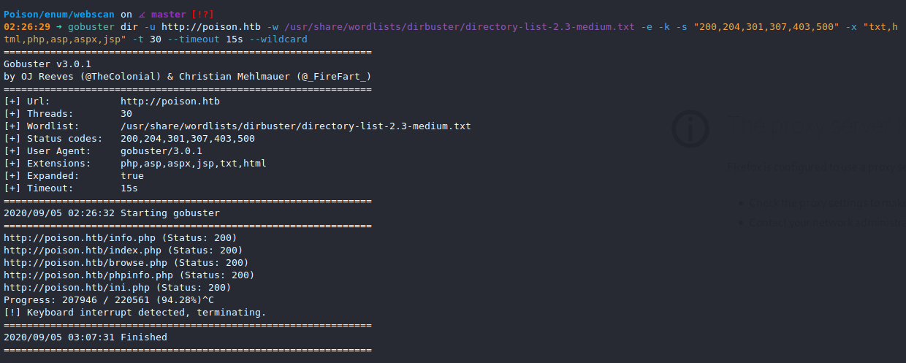
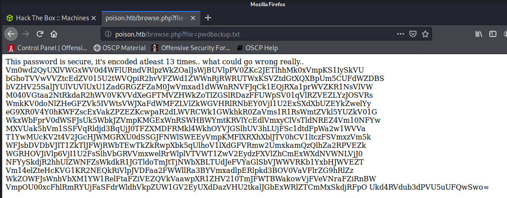
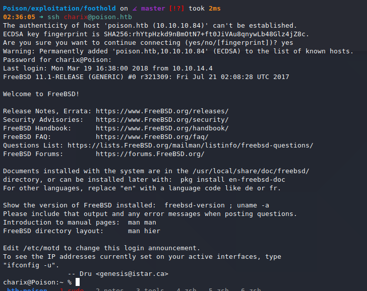
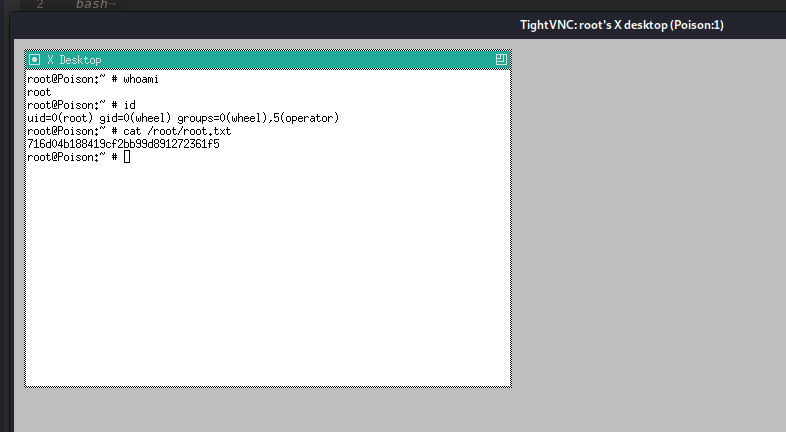

# Poison (`10.10.10.84`)

## `/etc/hosts`

I begin by adding an entry in `/etc/hosts` to resolve `poison.htb` to `10.10.10.84`. I use this later in my report.

## Enumeration

I start a portscan of all ports (`-p-`), running OS, service version, and vulnerability scripts (`-A`), skipping host discovery (`-Pn`), with verbose logging (`-v`) and output to a file (`-oN`).

```bash
$ nmap -A -v -p- -Pn -oN allports poison.htb
# Nmap 7.80 scan initiated Sat Sep  5 02:25:54 2020 as: nmap -A -sVC -v -p- -Pn -oA allports poison.htb
Nmap scan report for poison.htb (10.10.10.84)
Host is up (0.050s latency).
Not shown: 65533 closed ports
PORT   STATE SERVICE VERSION
22/tcp open  ssh     OpenSSH 7.2 (FreeBSD 20161230; protocol 2.0)
| ssh-hostkey: 
|   2048 e3:3b:7d:3c:8f:4b:8c:f9:cd:7f:d2:3a:ce:2d:ff:bb (RSA)
|   256 4c:e8:c6:02:bd:fc:83:ff:c9:80:01:54:7d:22:81:72 (ECDSA)
|_  256 0b:8f:d5:71:85:90:13:85:61:8b:eb:34:13:5f:94:3b (ED25519)
80/tcp open  http    Apache httpd 2.4.29 ((FreeBSD) PHP/5.6.32)
| http-methods: 
|_  Supported Methods: GET HEAD POST OPTIONS
|_http-server-header: Apache/2.4.29 (FreeBSD) PHP/5.6.32
|_http-title: Site doesn't have a title (text/html; charset=UTF-8).
No exact OS matches for host (If you know what OS is running on it, see https://nmap.org/submit/ ).
TCP/IP fingerprint:
OS:SCAN(V=7.80%E=4%D=9/5%OT=22%CT=1%CU=37236%PV=Y%DS=2%DC=T%G=Y%TM=5F533F52
OS:%P=x86_64-pc-linux-gnu)SEQ(SP=104%GCD=1%ISR=10C%TI=Z%CI=Z%TS=22)SEQ(SP=1
OS:06%GCD=1%ISR=109%TI=Z%CI=Z%II=RI%TS=20)OPS(O1=M54DNW6ST11%O2=M54DNW6ST11
OS:%O3=M280NW6NNT11%O4=M54DNW6ST11%O5=M218NW6ST11%O6=M109ST11)WIN(W1=FFFF%W
OS:2=FFFF%W3=FFFF%W4=FFFF%W5=FFFF%W6=FFFF)ECN(R=Y%DF=Y%T=40%W=FFFF%O=M54DNW
OS:6SLL%CC=Y%Q=)T1(R=Y%DF=Y%T=40%S=O%A=S+%F=AS%RD=0%Q=)T2(R=N)T3(R=Y%DF=Y%T
OS:=40%W=FFFF%S=O%A=S+%F=AS%O=M109NW6ST11%RD=0%Q=)T4(R=Y%DF=Y%T=40%W=0%S=A%
OS:A=Z%F=R%O=%RD=0%Q=)T5(R=Y%DF=Y%T=40%W=0%S=Z%A=S+%F=AR%O=%RD=0%Q=)T6(R=Y%
OS:DF=Y%T=40%W=0%S=A%A=Z%F=R%O=%RD=0%Q=)T7(R=Y%DF=Y%T=40%W=0%S=Z%A=S+%F=AR%
OS:O=%RD=0%Q=)U1(R=Y%DF=N%T=40%IPL=38%UN=0%RIPL=G%RID=G%RIPCK=G%RUCK=G%RUD=
OS:G)IE(R=Y%DFI=S%T=40%CD=S)

Uptime guess: 0.000 days (since Sat Sep  5 02:33:31 2020)
Network Distance: 2 hops
TCP Sequence Prediction: Difficulty=264 (Good luck!)
IP ID Sequence Generation: All zeros
Service Info: OS: FreeBSD; CPE: cpe:/o:freebsd:freebsd

TRACEROUTE (using port 3306/tcp)
HOP RTT      ADDRESS
1   47.63 ms 10.10.14.1
2   47.67 ms poison.htb (10.10.10.84)

Read data files from: /usr/bin/../share/nmap
OS and Service detection performed. Please report any incorrect results at https://nmap.org/submit/ .
# Nmap done at Sat Sep  5 02:33:38 2020 -- 1 IP address (1 host up) scanned in 464.43 seconds
```




Looks like we have a password backup file, as well as the possibility for an LFI.




I try to `ssh` in and the combination `charix:Charix!2#4%6&8(0` works.



I find a `secret.zip` file in `/home/charix`. It's encrypted but the password we've uncovered already works.


It appears to be a file filled with junk.


I find a `VNC` process.


I set up `proxychains` like this:

```bash
$ tail /etc/proxychains.conf
#
#       proxy types: http, socks4, socks5
#        ( auth types supported: "basic"-http  "user/pass"-socks )
#
[ProxyList]
# add proxy here ...
# meanwile
# defaults set to "tor"
socks4  127.0.0.1 8081
```

Then I enable dynamic port forwarding with: `$ ssh charix@10.10.10.84 -D 8081`.

And I use the port forwarding to authenticate to the VNC session with: `$ proxychains vncviewer 127.0.0.1:5901 -passwd secret`



